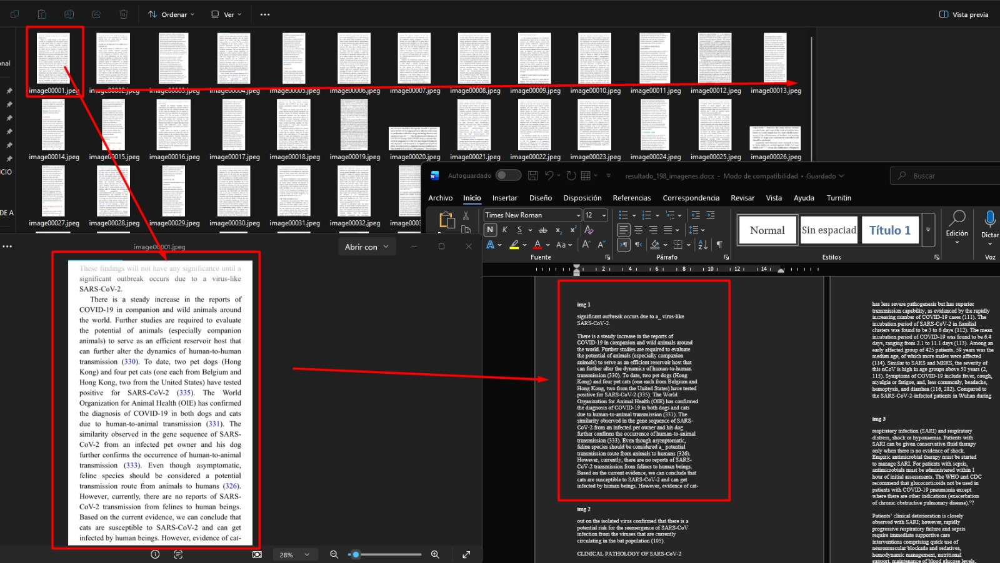

# Automatizador OCR de imágenes

Script en Python que extrae texto de imágenes mediante OCR y lo guarda en un documento de Word.

## Vista previa



## Características

- Procesa todas las imágenes de una carpeta.
- Ordena los archivos de forma natural, por ejemplo: `image2.jpeg` antes de `image10.jpeg`.
- Soporta archivos `.png`, `.jpg`, `.jpeg`, `.bmp` y `.tiff`.
- Conserva los guiones y saltos de línea reconocidos por Tesseract.
- Genera un archivo `.docx` con una sección numerada para cada imagen.
- Usa fuente Times New Roman de 12 puntos.

## Requisitos

- Python 3.9 o superior.
- Tesseract OCR.
- Paquetes de Python:

```bash
pip install pillow pytesseract python-docx
```

### Instalar Tesseract OCR en Windows

Descarga e instala Tesseract desde:

<https://github.com/UB-Mannheim/tesseract/wiki>

El script busca automáticamente Tesseract en el `PATH` y en estas rutas habituales:

```text
C:\Program Files\Tesseract-OCR\tesseract.exe
C:\Program Files (x86)\Tesseract-OCR\tesseract.exe
```

## Configuración y uso

1. Cambia `CARPETA_IMAGENES` en `automatizar_imagenes.py` por la ruta de tus imágenes.
2. El OCR usa inglés (`eng`). Para español, instala el idioma de Tesseract y cambia a `spa`.
3. Ejecuta:

```bash
python automatizar_imagenes.py
```

El programa procesa todas las imágenes y crea `resultado_198_imagenes.docx`.

## Estructura recomendada

```text
CODIGO_PY/
├── automatizar_imagenes.py
├── README.md
└── IMAGENES/
    ├── image00001.jpeg
    ├── image00002.jpeg
    └── ...
```

## Nota sobre la precisión

El script conserva la salida completa generada por Tesseract, pero el OCR puede confundir letras, números o símbolos cuando la imagen tiene baja resolución, ruido, inclinación o texto poco legible. El resultado debe revisarse después de la conversión.

## Licencia

Añade aquí la licencia que quieras utilizar para el repositorio.
